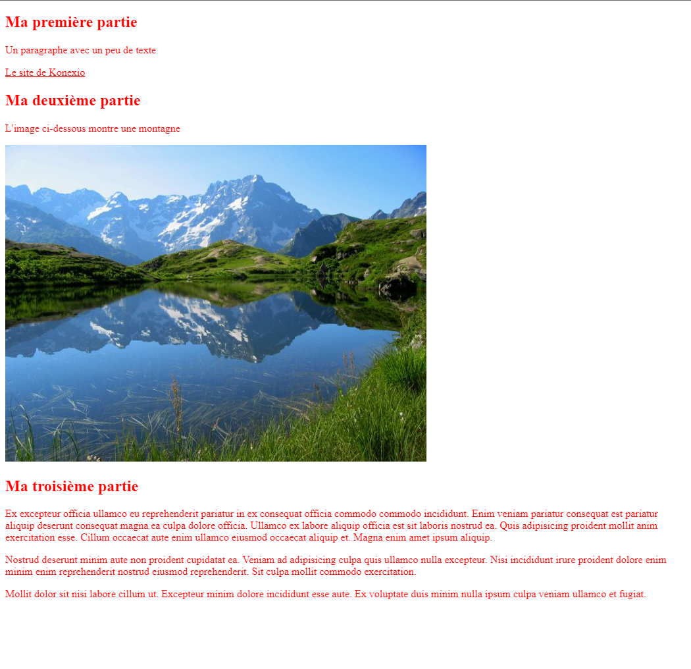
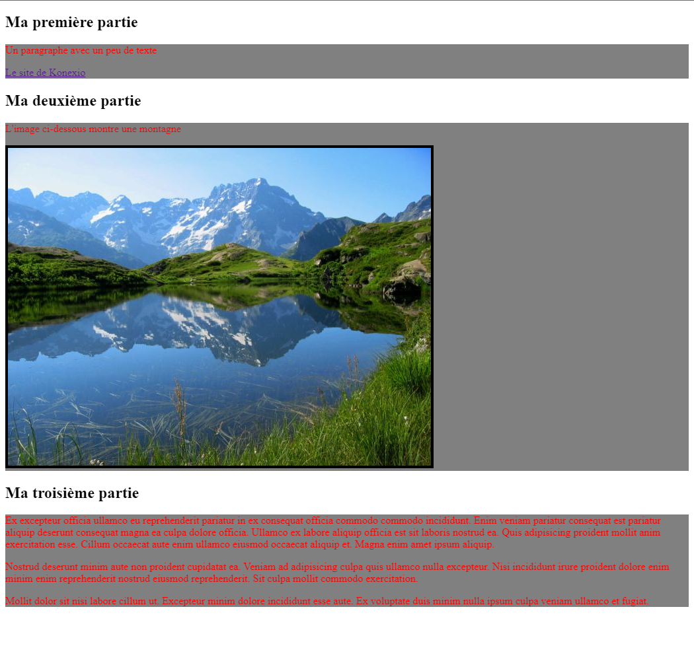
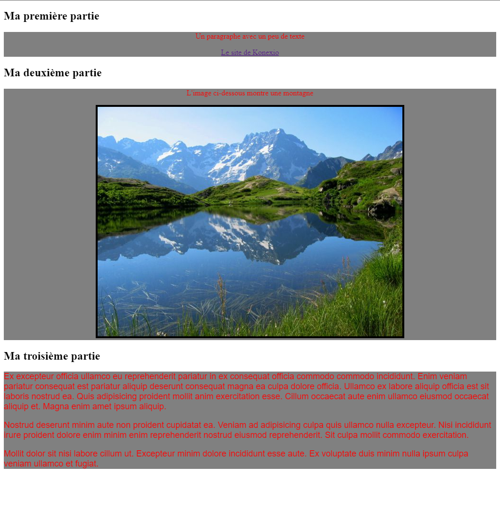
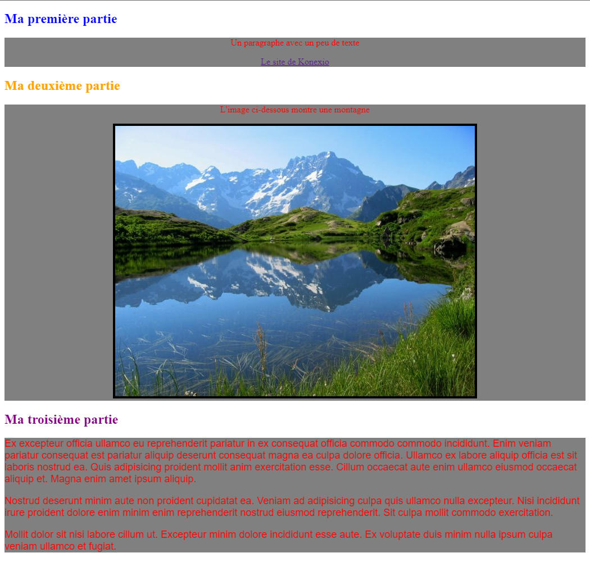
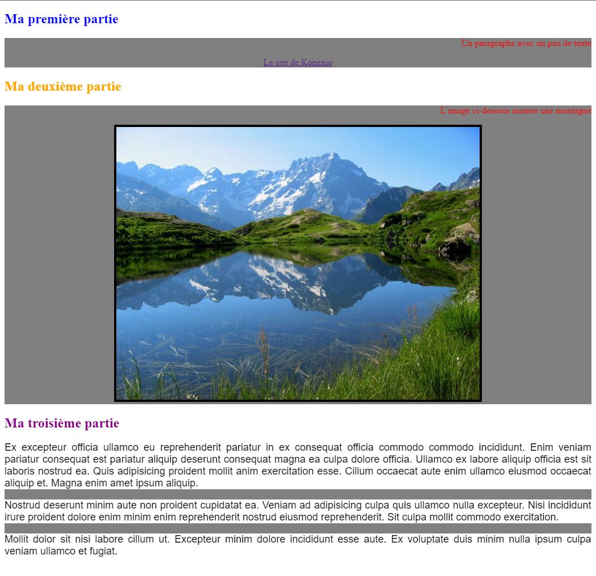

# Session 3 : Introduction au CSS

## Cours

[Cliquer ici pour consulter le cours](https://docs.google.com/presentation/d/1dg38FJXCl1ziTAqSmZfFF7qrLgn93YQkcbgoRoBHC80/edit?usp=sharing)

## Documentation

[Cliquer ici pour consulter la documentation CSS sur MDN](https://developer.mozilla.org/fr/docs/Web/CSS/Reference#Index_des_mots-cl%C3%A9s)

## Exercice 1 : Ajouter du CSS au HTML

- Créer un nouveau fichier nommé `style.css` dans le dossier `session3`.
- Dans l
  
'élément `<head>` du fichier `index.html`, insérer une balise permettant de lier ce document HTML au nouveau fichier `style.css`.

Ajoutez le code ci-dessous dans `style.css` pour vérifier que tout fonctionne bien. Le texte de la page deviendra rouge après le rechargement du navigateur web.

**Effacez ce code avant de passer à la suite.**

```css
* {
  color: red;
}
```

### Résultat attendu pour l'exercice 1

**Rappel : Effacez ce code CSS avant de passer à la suite.**



## Exercice 2 : Les sélecteurs de type

**Rappel: Vérifiez le résultat de chaque règle en rechargeant votre page dans le navigateur web.**

Dans le fichier `style.css` :

- Écrire une règle pour appliquer un fond gris (valeur `grey`) pour tous les éléments `<div>` grâce à la propriété `background-color`.
- Écrire une règle pour changer la couleur des éléments `<p>` en rouge (valeur `red`).
- Écrire une règle pour ajouter une bordure noire de 4 pixels aux éléments `` grâce à la propriété CSS `border`.

### Résultat attendu pour l'exercice 2



## Exercice 3 : Les sélecteurs de classe

**Rappel: Vérifiez le résultat de chaque règle en rechargeant votre page dans le navigateur web.**

Dans le fichier `style.css` :

- Écrire une règle pour centrer les éléments ayant la classe `contenu-mixte` (attribut HTML `class="contenu-mixte"`) avec la propriété `text-align`.
- Écrire une règle pour utiliser la police de caractères `Arial` (avec la propriété `font-family`) sur les éléments ayant la classe `contenu-texte`, puis une autre pour y appliquer une taille d'écriture de 18 pixels (avec la propriété `font-size`).

### Résultat attendu pour l'exercice 3



## Exercice 4 : Les sélecteurs d'ID

**Rappel: Vérifiez le résultat de chaque règle en rechargeant votre page dans le navigateur web.**

Dans le fichier `style.css` :

- Écrire une règle pour appliquer la couleur bleue (valeur `blue`) à l'élément ayant l'ID `section-1`.
- Écrire une règle pour appliquer la couleur orange (valeur `orange`) à l'élément ayant l'ID `section-2`.
- Écrire une règle pour appliquer la couleur violet (valeur `purple`) à l'élément ayant l'ID `section-3`.

### Résultat attendu pour l'exercice 4



## Exercice 5 : Les sélecteurs descendants

**Rappel: Vérifiez le résultat de chaque règle en rechargeant votre page dans le navigateur web.**

Dans le fichier `style.css` :

- Écrire une règle pour aligner à droite les éléments `<p>` enfants des éléments ayant une classe `contenu-mixte` grâce à la propriété `text-align`.
- Écrire une règle pour justifier le texte des éléments `<p>` enfants de l'élément ayant l'ID `section-3`, toujours avec la propriété `text-align`.
- Écrire deux autres règles pour les mêmes éléments (`<p>` enfants de l'ID `section-3`) pour que leur texte soit écrit en noir et qu'ils aient une couleur de fond en blanc.

### Résultat attendu pour l'exercice 5


